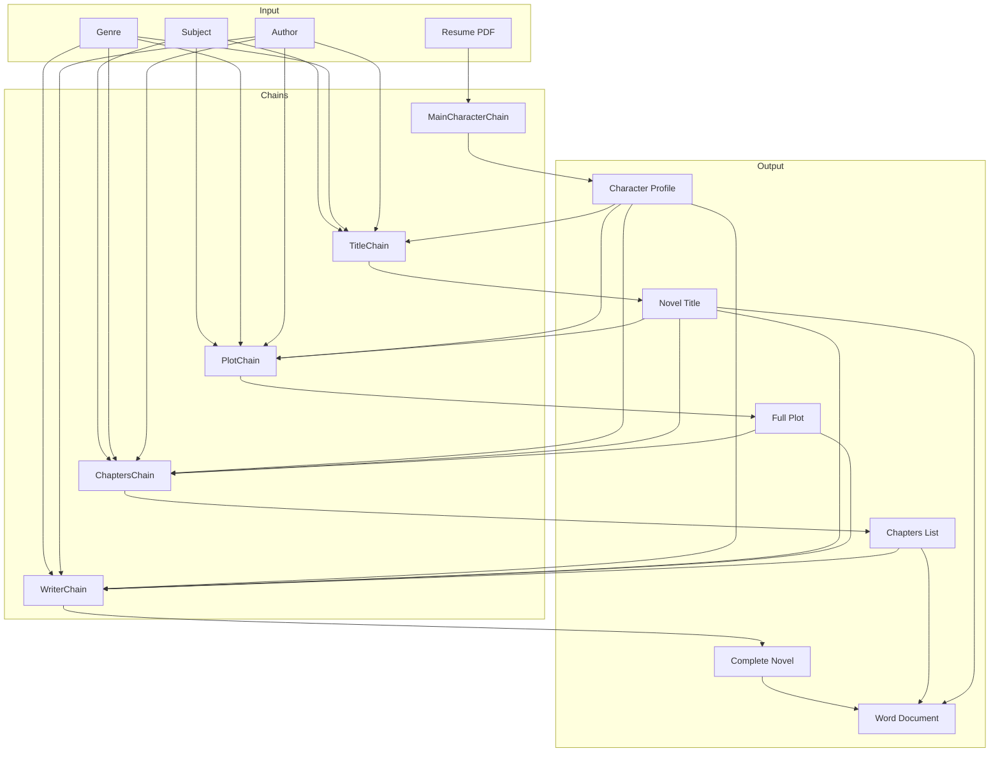

# ResuWrite

## Overview

ResuWrite is an AI-powered novel generation system that transforms a person's resume into a creative story. Using a series of specialized LLM chains, the system analyzes a resume, creates a character profile, and then generates a complete novel with chapters, plots, and events tailored to that character.

## Architecture



## Components

### 1. LLM Provider

ResuWrite uses Groq as the LLM provider, leveraging powerful language models like `llama-3.3-70b-versatile` or `mixtral-8x7b-32768` through the LangChain integration.

### 2. Chains

The system is composed of five specialized LLM chains:

#### MainCharacterChain
- **Purpose**: Analyzes a resume and creates a character profile
- **Input**: PDF resume
- **Output**: Textual description of the person's profile
- **Process**: Loads and splits PDF, combines content, and runs through LLM

#### TitleChain
- **Purpose**: Generates an appropriate title for the novel
- **Input**: Subject, genre, author, and character profile
- **Output**: Novel title
- **Process**: Considers all inputs to create a genre and author-appropriate title

#### PlotChain
- **Purpose**: Creates a complete plot for the novel
- **Input**: Subject, genre, author, profile, and title
- **Output**: Detailed plot description
- **Process**: Uses a helper chain to generate storytelling attributes, then creates a full plot

#### ChaptersChain
- **Purpose**: Generates a structured chapter list
- **Input**: Subject, genre, author, profile, title, and plot
- **Output**: Dictionary of chapters and their descriptions
- **Process**: Creates a prologue, numbered chapters, and an epilogue

#### WriterChain
- **Purpose**: Writes the actual content for each chapter event
- **Input**: Genre, author, title, profile, plot, previous events, chapter summary, and current event
- **Output**: Paragraphs of story content
- **Process**: Maintains continuity while generating new content for each event

### 3. Document Processing

- **PDF Loading**: Uses `PyPDFLoader` to extract text from resumes
- **Word Document Creation**: Uses `python-docx` to format and save the final novel

## Installation

1. Clone the repository
2. Install dependencies:
   ```bash
   pip install python-dotenv langchain-groq langchain pypdf2 python-docx
   ```
3. Create a `.env` file with your Groq API key:
   ```
   GROQ_API_KEY=your_api_key_here
   ```

## Usage

1. Place a resume PDF in the `./docs` folder
2. Edit the `main()` function in `app.py` to set your desired:
   - Subject
   - Author name
   - Genre
   - Resume file name
3. Run the application:
   ```bash
   python app.py
   ```
4. The generated novel will be saved as a Word document in the `./docs` folder

## File Structure

```
.
├── app.py             # Main application code
├── .env               # Environment variables (API keys)
├── docs/              # Input and output documents
│   ├── Divija_Prof.pdf  # Example resume
│   └── Generated_Novel.docx  # Output file
├── README.md          # This file
└── requirements.txt   # Dependencies
```

## Workflow

1. **Resume Analysis**: The system begins by loading and analyzing a resume PDF
2. **Character Creation**: A profile is generated based on the resume content
3. **Story Framework**: Title, plot, and chapter structure are created
4. **Content Generation**: Each chapter is populated with events and paragraphs
5. **Document Creation**: The final novel is formatted and saved as a Word document

## Customization

You can customize the system by:
- Modifying the prompt templates in each chain
- Adjusting the LLM parameters (temperature, model)
- Adding additional chains for more complex story elements
- Expanding the event generation for more detailed chapters

## Limitations

- The quality of the generated novel depends on the resume content and LLM capabilities
- Long novels may require multiple API calls and can be time-consuming
- The current implementation uses a simplified approach to event generation

## Future Enhancements

- Implement more sophisticated event planning
- Add character relationship mapping
- Include theme and motif analysis
- Provide style customization options
- Create a web interface for easier use

## Dependencies

- langchain-groq
- langchain
- python-dotenv
- PyPDFLoader
- python-docx

## License

This project is licensed under the MIT License.
